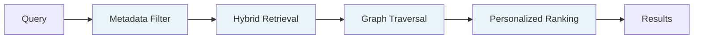

> ## Documentation Index
> Fetch the complete documentation index at: https://docs.hydradb.com/llms.txt
> Use this file to discover all available pages before exploring further.

# Introduction

> HydraDB is an ontology-first context layer for stateful AI applications. It uses an autonomous graph-aware retrieval engine that replaces vector databases at scale.

## What HydraDB is

HydraDB is a retrieval API for stateful AI agents. You ingest your documents, messages, user preferences, and workflows, and HydraDB autonomously prepares a context graph that captures entities and relationships. HydraDB returns the correct context whenever your agent requests it.

HydraDB is best for teams building scalable, stateful AI agents, whether you're at 10K documents or 10M.

Moreover, **HydraDB** is built as a develop-first plug-and-play context infrastructure. Imagine Stripe for context, instead of payments. Now, rather than hacking together brittle pipelines for embedding tools, vector databases, ranking tweaks and caching layers, HydraDB can do all of that in a single API call, with better retrieval.

**Some use cases:**

- Customer support agents grounded in real customer history and preferences
- Research copilots reasoning across papers, authors, findings
- Internal knowledge assistants spanning Slack, Notion, Drive, and email
- Consumer AI apps where every user gets personalized context

Find more brilliant use cases at [Cookbooks](/cookbooks)

**Skip ahead:** [Quickstart](/quickstart) · [API Reference](/api-reference) · [SDKs](/sdk/overview)

---

## Why vector search breaks at scale

Most AI systems retrieve context the same way. Embed everything. Run a vector search. Return whatever feels closest.

This works at a small scale. It breaks at production scale.

Embeddings can't tell a Q3 renewal clause from a Q1 termination notice when the language is close enough. Ask your AI about a contract, and at 10M+ documents, it will confidently return an answer pulled from a completely different client's file. The vector similarity might read 0.94. The answer is still wrong.

The failure mode isn't the embedding model. It's the assumption that semantic similarity equals relevance.

## How HydraDB is different

HydraDB builds an **ontology-first context graph** over your data. Entities, relationships, and temporal signals are extracted automatically. When you ask about "Apple," HydraDB knows you mean the customer you serve, not the fruit.

Every retrieval runs through a multi-stage pipeline:

Each stage adds a signal that vector search cannot provide. Metadata filters scope the search deterministically. Graph traversal surfaces structural relationships. Personalized ranking adapts to the user, the agent, and the task.

## Key features

- **Ontology-first context graph** - entities and relationships extracted automatically
- **Plug-and-play SDK** - TypeScript and Python with full type safety
- **Multi-tenant by default** - isolated workspaces at tenant and sub-tenant levels
- **Long-term memory** - preferences and behavioural signals that persist and evolve
- **Hybrid retrieval** - semantic, keyword, graph, and metadata signals in one API call
- **One-click self-hosting** - deploy your own instance with a single Docker command

## Get started

1. Sign up at [app.hydradb.com](https://app.hydradb.com) for your API key
2. Follow the [Quickstart](/quickstart) and get your first recall in five minutes
3. Explore [Core Concepts](/core-concepts) and the [API Reference](/api-reference) for detailed steps to use HydraDB.

For enterprise onboarding, contact [founders@hydradb.com](mailto:founders@hydradb.com).
