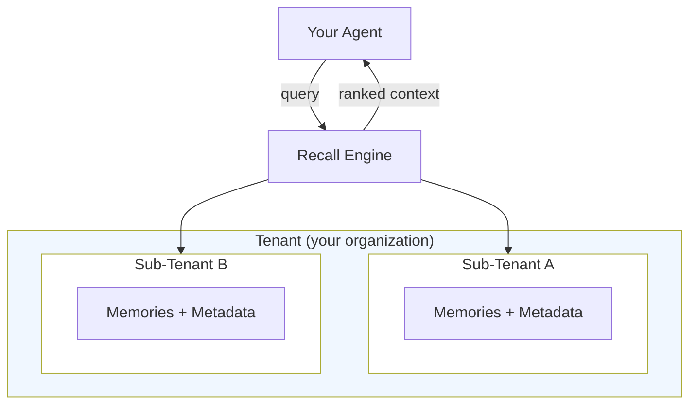

> ## Documentation Index
> Fetch the complete documentation index at: https://docs.hydradb.com/llms.txt
> Use this file to discover all available pages before exploring further.

# Core Concepts

> A tour of the four primitives that make HydraDB work. Each section is a short overview that links to its deeper [Essentials](/essentials) page.

## The four primitives

| Primitive | What it is | Deep dive |
|---|---|---|
| **Memories** | Atoms of content — documents, messages, preferences | [Essentials → Memories](/essentials/memories) |
| **Recall** | How agents read context from HydraDB | [Essentials → Recall](/essentials/recall) |
| **Tenants** | Isolated workspaces with sub-tenant hierarchy | [Essentials → Multi-Tenant](/essentials/multi-tenant) |
| **Metadata** | Structured filters for deterministic retrieval | [Essentials → Metadata](/essentials/metadata) |

**Looking for something else?** [API Reference](/api-reference) · [Quickstart](/quickstart) · [Architecture](/architecture)

---

## The mental model

Memories live inside sub-tenants. Sub-tenants live inside tenants. Metadata scopes and filters them. Recall is how your agent reads across the whole structure.



---

## Memories

Memories are the atoms of HydraDB — any piece of unstructured content that carries meaning. Documents, PDFs, emails, messages, webpages, presentations, reports, user preferences, past conversations, CSVs.

HydraDB parses, chunks, embeds, and links each memory into a shared context graph.

Three classes you'll work with:

- **User memories** — personal preferences and interaction history
- **Knowledge memories** — organizational content (Slack, PDFs, Notion)
- **Organizational memories** — shared policies available to all agents

[Read more → Essentials → Memories](/essentials/memories)

---

## Recall

Recall is how agents read from HydraDB. Storing data is easy; knowing *what* to retrieve, *when*, and *why* is the hard part.

HydraDB's recall is not vector search. It's a multi-stage pipeline combining metadata filtering, semantic and keyword retrieval, graph traversal, and personalized ranking based on the user, agent, and task.

[Read more → Essentials → Recall](/essentials/recall)

---

## Tenants and Sub-Tenants

A **tenant** is a workspace — typically one per organization. Fully isolated: no tenant can read another tenant's data.

A **sub-tenant** is a subdivision inside a tenant — a team, a project, or an individual user.

- **B2B** — each customer is a tenant; their departments are sub-tenants
- **B2C** — one tenant; each end user is a sub-tenant

<Warning>
**Sub-tenants are created automatically.** The first time you use a new `sub_tenant_id`, HydraDB creates it silently. There is no explicit creation step, and no confirmation is returned in the response. Typos create orphan sub-tenants — validate `sub_tenant_id` values before sending.
</Warning>

[Read more → Essentials → Multi-Tenant Support](/essentials/multi-tenant)

---

## Metadata

Metadata makes recall deterministic. Semantic search is powerful, but production systems need hard filters — "only Engineering docs," "only last 30 days," "only approved policies."

Two tiers:

- **Tenant metadata** — organizational fields defined at tenant creation. Immutable schema.
- **Document metadata** — per-document fields attached at ingestion. Fully flexible.

At ingestion:

```json
{
  "tenant_metadata": { "compliance_framework": "SOC2", "region": "us" },
  "document_metadata": {
    "project": "phoenix",
    "owner": "sarah.chen@acme.com",
    "status": "approved",
    "tags": ["security", "api"]
  }
}
```

At query time:

```json
{
  "query": "latest pricing strategy",
  "metadata_filters": { "project": "phoenix", "status": "approved" }
}
```

Filters apply *before* semantic ranking — turning "semantically similar" into "semantically similar *and* provably scoped."

[Read more → Essentials → Metadata](/essentials/metadata)

---

## What's next

- [Architecture Overview](/architecture) — how the graph, vector store, and ranking layers fit together
- [Quickstart](/quickstart) — build your first integration in five minutes
- [Essentials](/essentials) — deeper coverage of every concept on this page
