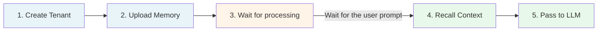
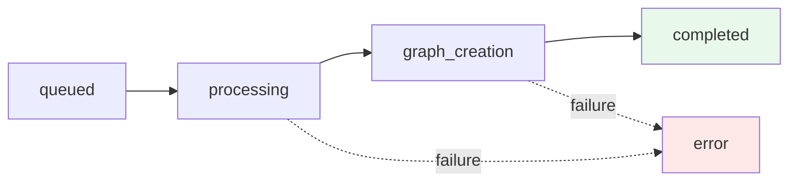

# Quickstart

> Build your first working recall in five minutes.

**Already have a tenant?** Jump to [Step 2 - Upload memories](#step-2-upload-memories)

**Already ingested data?** Jump to [Step 4 - Recall context](#step-4-recall-context)

**Prefer the SDK?** See [SDKs](/sdk/overview) for TypeScript and Python clients.

---

## What you'll build



The orange step is async, i.e., HydraDB parses, chunks, embeds, and graphs your content in the background. The rest runs in real time.

## Prerequisites

- Any backend language that speaks HTTP
- An API key from [app.hydradb.com](https://app.hydradb.com)

All endpoints use `https://api.hydradb.com` as the base URL and require a Bearer token:

```bash
Authorization: Bearer <your_api_key>
```

---

## Step 1 - Create a tenant

A tenant is your isolated workspace.

> A list of all tenants, along with their status, is available on [app.hydradb.com/tenants](https://app.hydradb.com/tenants)

```bash
curl -X POST 'https://api.hydradb.com/tenants/create' \
 -H "Authorization: Bearer <your_api_key>" \
  -H "Content-Type: application/json" \
 -d '{"tenant_id": "my_first_tenant"}'
```

**Response:**

```json
{
  "status": "accepted",
  "tenant_id": "my_first_tenant",
  "message": "Tenant creation started in the background. Use GET /tenants/infra/status?tenant_id=... to check progress."
}
```

Tenant creation is **asynchronous**. Poll for readiness before ingesting:

```bash
curl 'https://api.hydradb.com/tenants/infra/status?tenant_id=my_first_tenant' \
 -H "Authorization: Bearer <your_api_key>"
```

Wait until `graph_status: true` and both values in `vectorstore_status` are `true`.

**Response:**

```json
{
    "tenant_id": "my_first_tenant",
    "org_id": "free",
    "infra": {
        "scheduler_status": true,
        "graph_status": true,
        "vectorstore_status": [
            true,
            true
        ]
    },
    "message": "Deployed infrastructure status"
}
```

---

## Step 2 - Upload memories

> A list of all memories, along with their status, is available on [app.hydradb.com/knowledge](https://app.hydradb.com/knowledge)

There are two ways, depending on what you're ingesting.

### Option A: Uploading documents (PDF, DOCX, etc.)

Use this for files HydraDB should parse and chunk.

```bash
curl -X POST 'https://api.hydradb.com/ingestion/upload_knowledge' \
 -H "Authorization: Bearer <your_api_key>" \
  -F "files=@/path/to/contract.pdf" \
 -F "tenant_id=my_first_tenant"
```
**Response:**

```json
{
    "success": true,
    "message": "Knowledge uploaded successfully",
    "results": [
        {
            "source_id": "ef3ea754019855e2b39e9ab5c2d26096",
            "filename": "Tutorial-6.pdf",
            "status": "queued",
            "error": null
        }
    ],
    "success_count": 1,
    "failed_count": 0
}
```	

### Option B: Upload user memories (text, markdown, conversations)

Use this for user preferences, conversation history, or inline text.

```bash
curl -X POST 'https://api.hydradb.com/memories/add_memory' \
 -H "Authorization: Bearer <your_api_key>" \
  -H "Content-Type: application/json" \
 -d '{
    "tenant_id": "my_first_tenant",
    "memories": [
 {
        "text": "User prefers detailed technical explanations and dark mode",
        "infer": true,
        "user_name": "Alex"
 }
 ]
 }'
```
**Response:**

``` json
{
    "success": true,
    "message": "Memories queued for ingestion successfully",
    "results": [
        {
            "source_id": "1d50e5cd7c196a2bbcc1a59b037b3a44",
            "title": null,
            "status": "queued",
            "infer": true,
            "error": null
        }
    ],
    "success_count": 1,
    "failed_count": 0
}
```

Both return a `source_id` which you can use to track processing and reference the memory later.

---

## Step 3 - Verify processing

Ingestion runs through a pipeline before content is searchable:



Check status any time:

```bash
curl -X POST \
 'https://api.hydradb.com/ingestion/verify_processing?file_ids=<source_id>&tenant_id=my_first_tenant' \
  -H "Authorization: Bearer <your_api_key>"
```

**Response:**

``` json
{
    "statuses": [
        {
            "file_id": "<source_id>",
            "indexing_status": "completed",
            "error_code": "",
            "error_message": "",
            "success": true,
            "message": "Processing status retrieved successfully"
        }
    ]
}
```

Poll every few seconds until the status is `completed`. Most documents index in 1–5 minutes; larger documents take longer.

---

## Step 4 - Recall context

Now the interesting part. Ask HydraDB what it knows:

```bash
curl -X POST 'https://api.hydradb.com/recall/full_recall' \
 -H "Authorization: Bearer <your_api_key>" \
  -H "Content-Type: application/json" \
 -d '{
    "tenant_id": "my_first_tenant",
    "query": "What are the pricing tiers?",
    "max_results": 5,
    "mode": "thinking",
    "graph_context": true
 }'
```
**Flags worth knowing:**

- `mode: "thinking"` enables personalized, multi-stage recall (higher latency, better results). The default is "fast", a simpler retrieval without personalization.
- `graph_context: true` enriches the response with entity relationships from the knowledge graph.
- For **documents and knowledge**, use `/recall/full_recall`. For **user memories**, use [`/recall/recall_preferences`](/api-reference/endpoint/recall-preferences).

**Sample response:**

```json
{
  "chunks": [
 {
      "chunk_uuid": "a1b2c3d4-...",
      "source_id": "doc_12345",
      "chunk_content": "The team discussed tiered pricing: $29/month Starter, $79/month Pro, $199/month Enterprise...",
      "source_title": "Q4 Pricing Strategy",
      "relevancy_score": 0.92,
      "document_metadata": { "author": "Product Team" }
 }
 ],
  "graph_context": {
    "query_paths": [
 {
        "triplets": [
 {
            "source": { "name": "Pricing Strategy" },
            "relation": { "canonical_predicate": "OWNED_BY" },
            "target": { "name": "Product Team" }
 }
 ]
 }
 ],
    "chunk_relations": [],
    "chunk_id_to_group_ids": {}
 }
}
```

The `chunks` array contains retrieved content ranked by relevance. The `graph_context` object contains entity relationships that HydraDB extracted from your data, which is useful for reasoning about *how* things connect, not just *what* was said.

---

## Step 5 - Pass it to your LLM

The `full_recall` response is JSON. Your LLM wants a clean string. Flatten chunks and graph context into a readable format, then pass it as prompt context.

For a production-ready Python and TypeScript implementation, see [How to Use API Results](/essentials/api-results). It includes a `build_context_string()` function you can drop into your codebase.

---

## You're done

That's the full loop: create a tenant, ingest content, wait for processing, recall context, feed it to an LLM. Everything else in HydraDB - metadata filters, sub-tenants, and graph traversal personalization - builds on this foundation.

**Where to go next:**

- [Essentials](/essentials) for deeper coverage of recall, memories, metadata, and context graphs
- [API Reference](/api-reference) for full endpoint documentation and schemas
- [Cookbooks](/cookbooks) for use cases.

Stuck? Reach out at [founders@hydradb.com](mailto:founders@hydradb.com).
